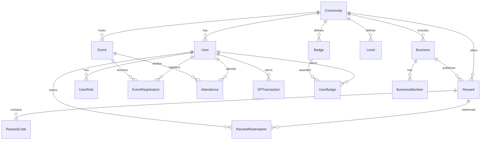

# رو‌به‌راه Telegram Mini App

Production-ready foundation for the **رو‌به‌راه** Telegram Mini App.

Tagline: **همراه هم برای رشد**

This repository is intentionally not a mock-only demo. It starts with a modular Next.js application, MySQL/Prisma persistence, server-side Telegram Mini App authentication, RBAC, service/repository separation, Docker, seed data, and focused tests for important business rules.

## Architecture

```text
Telegram Mini App
  -> Next.js App Router
  -> API Route Handlers
  -> Module Services
  -> Repositories
  -> Prisma
  -> MySQL
```

Important decisions:

- Route handlers parse requests and translate responses only.
- Business rules live in module services and policy files.
- Prisma access is kept in repositories for important domain flows.
- Telegram `initData` is always validated server-side.
- Authorization is checked on sensitive API routes, not only in React.
- `Community` exists in the database now, while the UX remains single-community.
- Registration and attendance are separate domain concepts.
- XP and badge grants are idempotent through unique constraints.
- Rewards are approved before public visibility and checked again during redemption.

## Folder Structure

```text
src/
  app/                  Next.js pages and API route handlers
  components/           Shared UI components
  lib/                  Config, Prisma, logger, utilities
  modules/
    auth/
    events/
    registrations/
    attendance/
    gamification/
    rewards/
  shared/               API response, errors, pagination
prisma/
  schema.prisma
  seed.ts
```

## Database ERD



## Core Flows

Authentication:

```text
Telegram opens Mini App
  -> Frontend sends initData
  -> Backend validates HMAC with bot token
  -> User is upserted by telegramId
  -> Internal UUID remains the domain primary key
```

Authorization:

```text
Current user
  -> roles loaded server-side
  -> requireRole([ADMIN, SUPER_ADMIN, ...])
  -> sensitive operation proceeds
```

Event registration:

```text
Published event
  -> deadline and duplicate checks
  -> capacity check
  -> REGISTERED or WAITLISTED
  -> no XP is awarded
```

Attendance:

```text
Admin verifies attendance
  -> Attendance becomes PRESENT
  -> XPService awards ATTEND_EVENT once
  -> BadgeService evaluates attendance badges
```

Rewards:

```text
Approved reward
  -> eligibility checked by XP, level, attendance
  -> usage limits checked in transaction
  -> redemption created
  -> optional code marked redeemed
```

## Local Setup

1. Install dependencies:

```bash
npm install
```

2. Copy environment values:

```bash
cp .env.example .env
```

3. Start MySQL:

```bash
docker compose up -d mysql
```

4. Run Prisma migration:

```bash
npm run prisma:migrate
```

5. Seed development data:

```bash
npm run prisma:seed
```

6. Start the app:

```bash
npm run dev
```

## Telegram Bot Setup

1. Create a bot in BotFather.
2. Put the token in `TELEGRAM_BOT_TOKEN`.
3. Host the app over HTTPS.
4. Configure the Mini App URL in BotFather to `NEXT_PUBLIC_APP_URL`.
5. The frontend should send Telegram WebApp `initData` to `POST /api/auth/telegram`.
6. Authenticated API calls should include `x-telegram-init-data`.

## API

Public:

- `GET /api/events`
- `GET /api/events/:eventId`
- `POST /api/events/:eventId/register`
- `DELETE /api/events/:eventId/register`
- `GET /api/rewards`
- `POST /api/rewards/:rewardId/redeem`
- `GET /api/me`

Admin:

- `POST /api/admin/events`
- `POST /api/admin/events/:eventId/attendance`

## Quality Commands

```bash
npm run typecheck
npm run lint
npm run test
npm run build
```

## Implementation Roadmap

1. Project foundation
2. Database and Prisma
3. Telegram authentication
4. User profile and member privacy
5. Events and registration
6. Admin event management
7. Manual attendance verification
8. XP, level, and badge engine
9. Business profiles and approval
10. Rewards marketplace and redemption
11. Admin rewards and businesses
12. UI polish
13. Critical integration tests
14. Docker deployment documentation
